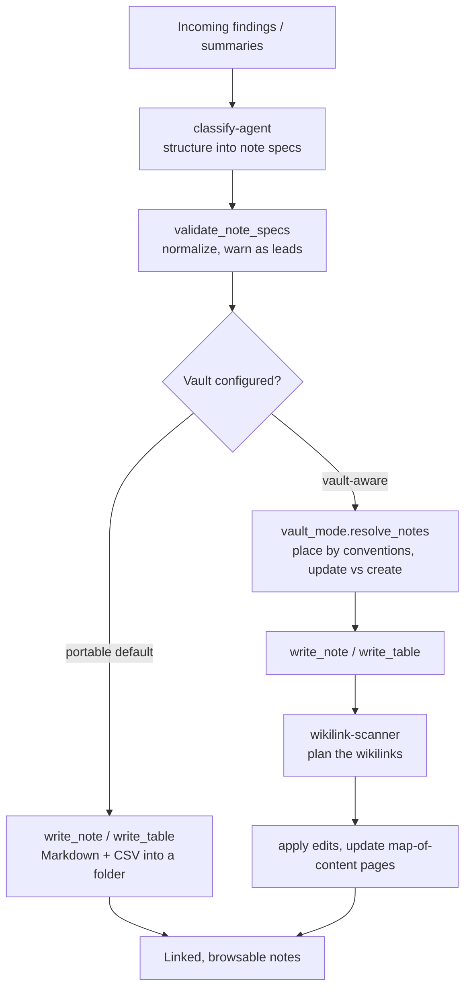

# Librarian

    

Librarian takes the findings you have already dug up (research summaries, extracted facts, the things you pulled out of a FOIA dump) and files them as clean, structured Markdown notes you can actually find again later. You hand it a batch of items, and it decides what each one is, tags it, lists its sources, and drops it in the right folder. Every note comes out with YAML frontmatter, a `## Sources` section built from your citations, and a filename derived from the title.

It works with nothing but a folder of Markdown files, so you do not need any particular app. If you keep an Obsidian vault, Librarian notices and does more: it places notes by your folder conventions, cross-links them with `[[wikilinks]]` to what you already have, and keeps your map-of-content pages current. It writes internal working notes for your own follow-up and retrieval, not articles for readers: polishing prose for an audience is Copydesk's job, and the two never step on each other.

## How it works



The path is the same one each Fieldwork tool feeds into: classify the findings into note specs, validate them, write the notes (Markdown, plus CSV for tables), and, only when a vault is present, scan for wikilinks and refresh the index pages.

## What you can do with it

- **Turn a batch of findings into filed notes.** "Turn these findings into notes" or "file this into my notes" runs the classify step, then writes each item as its own Markdown note with frontmatter and a sources section.
- **Classify summaries without committing to a folder layout.** "Classify these summaries" maps each item to a content type from your taxonomy (`report`, `reference`, `entity`, `event`, `dataset`, `analysis`, `timeline`, `index`, `source`, `note`), orders its tags, and sets its priority.
- **File a research pass straight into your vault.** "File these findings into my vault and update existing notes if they already exist" switches on vault mode: it queries your vault index, routes matching items to update existing notes, and places new ones by your folder conventions.
- **Write tabular exhibits as CSV.** Stats tables and redacted exhibits go through `write_table`, which emits a `.csv` file and hands back a Markdown-table mirror you can embed in a note.
- **Cross-link a batch you just wrote.** "Plan wikilinks for the notes I just created" runs the wikilink-scanner: it links mentions among the new notes and resolves their link hints, and (in vault mode) searches the index for existing notes to link to as well.

## Why it's useful

The tedious part of an investigation comes after the finding: keeping what you dug up in a shape you can still use weeks later. Librarian does that filing the same way every time. Notes are classified consistently, the same entity gets the same tag in every note, and every claim carries its sources, so two weeks later you can still tell where a fact came from.

Because the default output is plain Markdown and CSV with no vault, no index, and no network required, your notes are portable: they are just files you own, readable in any editor and movable to any tool. When you do run a vault, the extra wiring (wikilinks, folder placement, map-of-content updates) happens on top of that same portable core, never in place of it. And because it is the shared output layer for the whole Fieldwork suite, a Researcher web pass and a Magpie data pass both land in one consistent, linked set of notes instead of three different filing styles.

## Quick start

Install it from the Fieldwork marketplace:

```
/plugin marketplace add TimSimpsonJr/fieldwork-plugins
/plugin install librarian@fieldwork
```

Librarian is usually pulled in automatically as the output layer for Researcher and Magpie, so you may already have it. Installing it on its own works too.

No setup is required for portable mode: it writes Markdown and CSV into whatever folder you point it at. To use vault mode, have an Obsidian vault ready and supply its path as `vault_context` when you run it. To tailor the content types and folders to your beat, copy `config/taxonomy.example.json` to `config/taxonomy.json` and edit it.

Then hand it a batch of findings:

```
File these findings into notes.
```

## Under the hood

**Two modes from one core.** Portable mode is the default and a strict subset of vault mode: it never touches a vault, an index, or the network. Vault mode is layered on top and only switches on when you supply a `vault_context`.

| | Portable (default) | Vault-aware (vault_context present) |
|---|---|---|
| Output | Markdown notes + CSV tables into a folder | Same, placed by your vault's folder conventions |
| Dedup / update | `create` only; honors `update` only with an explicit target | Queries the vault index to route `update` vs `create` |
| Wikilinks | Links among the new batch + each note's link hints | Also searches the index for existing notes to link |
| Map-of-content | n/a | Refreshes MOC/index pages matching your `moc_pattern` |
| Dependencies | PyYAML + Python stdlib | Adds an optional SQLite FTS5 index under `<vault>/.librarian/` |

**The neutral note spec.** Every note flows through one contract the whole suite shares: `{title, content, frontmatter_meta, citations, link_hints, priority, action}`. The `classify-agent` (Haiku) emits it, `validate_note_specs` normalizes it, `vault_mode.resolve_notes` places it, and `write_note` / `write_table` render it.

**Config-driven taxonomy, not a hardcoded enum.** Content types, tag ordering and limits, the default folder, folder conventions, frontmatter fields, and the MOC pattern all come from `config/taxonomy.json` (falling back to the bundled neutral example). The skill and agents read those values; nothing is baked in.

**Flags as leads, never verdicts.** Validation warns about an unknown content type, an out-of-range tag count, a missing title, or an invalid priority, but it never drops a note. You review the warnings; the note still gets written.

**Safe by construction.** A classifier-supplied folder is untrusted, so placement strips drive letters and `..` traversal and falls back to the default folder, keeping every note under the output root. The note writer never clobbers an existing file: an identical re-run is reported as `identical`, and a genuine slug collision as `collision`, so nothing is silently overwritten. The writers take no clock, vault, or network (any `created` timestamp is supplied by the caller), so the same inputs always produce the same notes.

> [!NOTE]
> **What you need:** Python 3.12 and [Claude Code](https://docs.anthropic.com/en/docs/claude-code). Librarian is deliberately light: its only runtime dependency is PyYAML, and Claude installs it for you. There are no Docker or heavy-ML tiers here; mise and Node are for contributors only.

> [!IMPORTANT]
> **Your data & privacy:** Everything runs locally, inside your own Claude Code session. Librarian writes Markdown and CSV files to a folder you choose (or your vault); nothing is uploaded, and there is no external service or API key. The optional SQLite search index lives under `<vault>/.librarian/` on your own disk. Librarian itself does not scan for or remove PII (that is Magpie's job before findings reach this layer), though when a vault redaction policy is configured, vault mode enforces it as notes are written. The folder-traversal guard and never-clobber writer mean an adversarial finding can neither escape your output folder nor overwrite an existing note.

## For developers

```bash
pip install -r requirements-dev.txt
pytest tests/ -v
```

The suite is 111 tests, all offline, no API key needed. They cover the portable writer (frontmatter, sources, never-clobber), the table writer (CSV plus Markdown mirror), taxonomy load/merge and spec validation, the portable-vs-vault routing seam (including the guard that the portable path never imports SQLite), folder-traversal neutering, and that every shipped skill and agent has parseable frontmatter.

**Requirements:** Python 3.12, [Claude Code](https://docs.anthropic.com/en/docs/claude-code). An [Obsidian](https://obsidian.md/) vault is optional and only needed for vault mode.

**Runtime dependency:** PyYAML (frontmatter emission). The optional SQLite index uses the Python standard library; there is nothing extra to install. SQLite FTS5 is used when available, with a transparent LIKE-scan fallback when it is not.

## Part of the Fieldwork suite
- [Researcher](https://github.com/TimSimpsonJr/researcher): gather sources into cited notes
- [Magpie](https://github.com/TimSimpsonJr/magpie): analyze FOIA/data into findings
- [Librarian](https://github.com/TimSimpsonJr/librarian): file findings as linked notes (shared layer)
- [Copydesk](https://github.com/TimSimpsonJr/copydesk): write findings up in your voice

## License

MIT. See [LICENSE](LICENSE).
